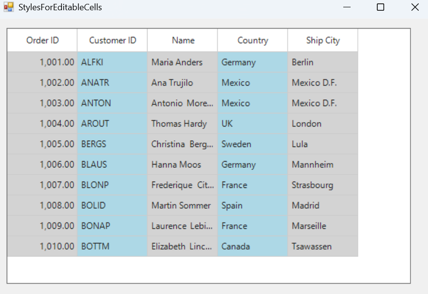

# How to Indicate editable cells with specific display styles in WinForms DataGrid?

In [WinForms DataGrid](https://www.syncfusion.com/winforms-ui-controls/datagrid) (SfDataGrid), editing at the column level is controlled by setting the [AllowEditing](https://help.syncfusion.com/cr/windowsforms/Syncfusion.WinForms.DataGrid.GridColumnBase.html#Syncfusion_WinForms_DataGrid_GridColumnBase_AllowEditing) property to true or false for each column. Editable columns can be visually indicated by applying a [BackColor](https://help.syncfusion.com/cr/windowsforms/Syncfusion.WinForms.DataGrid.Styles.CellStyleInfo.html#Syncfusion_WinForms_DataGrid_Styles_CellStyleInfo_BackColor) to the header or cells through the [QueryCellStyle](https://help.syncfusion.com/cr/windowsforms/Syncfusion.WinForms.DataGrid.SfDataGrid.html#Syncfusion_WinForms_DataGrid_SfDataGrid_QueryCellStyle) event.
 
 ```csharp
//Event subscription
sfDataGrid1.QueryCellStyle += OnQueryCellStyle;

//Event customization
private void OnQueryCellStyle(object sender, QueryCellStyleEventArgs e)
{
    // To apply cell back color for editable columns
    if (e.Column != null)
    {
        if (e.Column.AllowEditing is true)
            e.Style.BackColor = Color.LightBlue;
        else
            e.Style.BackColor = Color.LightGray;
    }
} 
 ```
 


Take a moment to peruse the [WinForms DataGrid - Conditional Styling](https://help.syncfusion.com/windowsforms/datagrid/conditionalstyling) documentation, to learn more about conditional styling with examples.